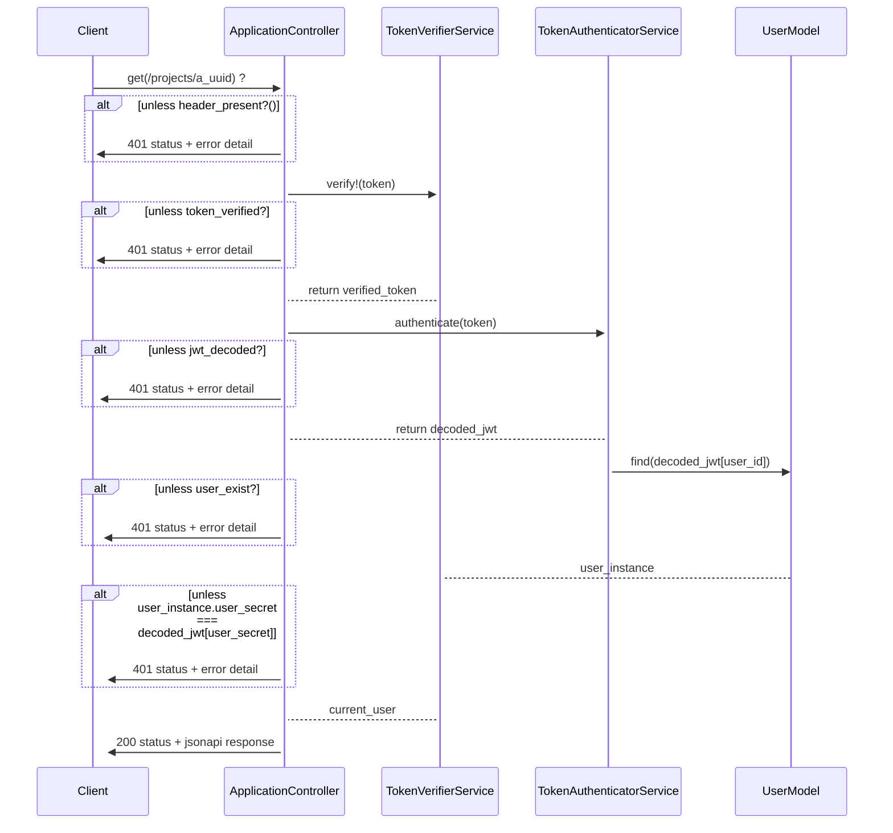

# Webhooks


The most simple project management tool in the world.

It doesn't even have authorization and UI 😱.




## Dependencies

- ruby-2.7.6
- postgres-11+

## Installation

Create `database.yaml` by duplicating `config/database.yml.example`. Then adjust the config to
match your development environment.

Run the following commands.

```bash
bundle install
bundle exec rails db:drop db:setup
```

Let's make sure everything is ready.

```bash
bundle exec rspec
```

## Assignment

- Clone the challenge repo and upload it as a new private repo.
- In your private repo, please check out a separate branch using your own name. When you're finished, you'll submit a pull request from this branch back to main.
- Add token-based authentication to the existing API.
- Cover the changes with tests.
- Ensure that the new code follows the existing Rubocop rules.
- Extract all business logic from controllers and models into a service layer.
- Write documentation for all new methods and models.
- You can use any gem to solve any part of the assignment. Provide a detailed comment
  explaining why you chose a certain gem.
- **IMPORTANT:** Open a PR with your solution in your repo. Do not open a PR in the original repo.
- Assign `ayarotsky` as a reviewer.

You're good to go. Happy coding 🤘!


